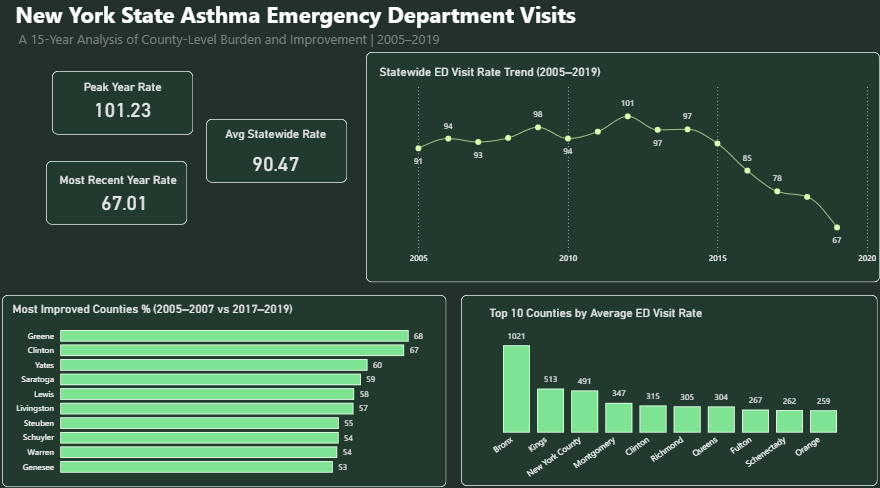
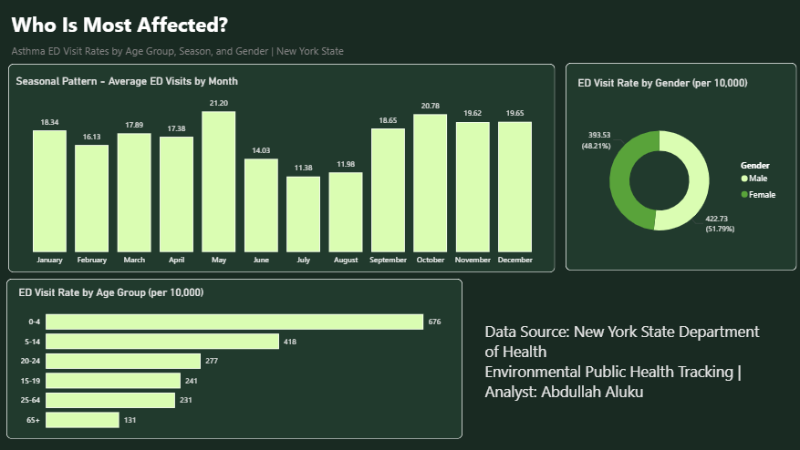

# NY State Asthma Emergency Department Visits Analysis

### Project Overview
Analysis of 15 years of real government surveillance data from the 
New York State Department of Health, covering asthma emergency 
department (ED) visit patterns across 62 counties from 2005 to 2019. 
This is a population-level analysis examining where asthma burden 
is highest, which populations are most affected, and whether 
outcomes have improved over time.

### Data Source
- **Provider:** New York State Department of Health, Environmental 
  Public Health Tracking
- **Dataset:** NYS Asthma Emergency Department Visits & Hospitalizations
- **Period:** 2005 – 2019
- **Records:** 3,870 rows across 62 counties
- **Download:** https://apps.health.ny.gov/statistics/environmental/public_health_tracking/tracker/files/asthma2/NYS_ASTHMA.csv

### Column Notes
| Column | Description |
|---|---|
| indicator | ED Visits or Hospitalizations |
| county | 62 NY counties + state aggregates |
| year | single years AND rolling 3-year ranges, stored as VARCHAR |
| subgroup1 | Total, AgeGroup, or Month |
| subgroup_cat1 | actual value (age band, month number); NULL for total rows |
| subgroup_cat2 | gender: M, F, or blank |
| crude_rate | rate per 10,000 population (used consistently throughout) |
| aa_rate | age-adjusted rate per 10,000 (nearly identical to crude_rate here) |
| visit_count | raw count (renamed from `count` to avoid a SQL function name clash) |

### Analysis Questions & Key Findings

**Q1: Top 10 Counties by Average ED Visit Rate**
```sql
SELECT 
    county,
    ROUND(AVG(crude_rate), 2) AS avg_crude_rate
FROM asthma
WHERE indicator = 'ED Visits'
    AND subgroup1 = 'Total'
    AND subgroup_cat1 IS NULL
    AND year NOT LIKE '%-%'
    AND county NOT IN (
        'New York State',
        'New York City',
        'NYS excluding NYC'
    )
GROUP BY county
ORDER BY AVG(crude_rate) DESC;
```
**Answer:**
| county | avg_crude_rate |
|---|---|
| Bronx | 1021 |
| Kings | 513 |
| New York | 491 |
| Montgomery | 347 |
| Clinton | 315 |
| Richmond | 305 |
| Queens | 304 |
| Fulton | 267 |
| Schenectady | 262 |
| Orange | 259 |

The Bronx carries the highest burden at 1,021 per 10,000  -  nearly 
double Kings County (513) and New York County (491). The 
concentration of burden in NYC boroughs suggests urban environmental 
and socioeconomic factors are significant drivers.

**Q2: ED Visit Rate by Age Group**
```sql
SELECT 
    subgroup_cat1 AS age_group,
    ROUND(AVG(crude_rate), 2) AS avg_crude_rate
FROM asthma
WHERE indicator = 'ED Visits'
    AND subgroup1 = 'AgeGroup'
GROUP BY subgroup_cat1
ORDER BY AVG(crude_rate) DESC;
```
**Answer:**
| age_group | avg_crude_rate |
|---|---|
| 0-4 | 676 |
| 5-14 | 418 |
| 20-24 | 277 |
| 15-19 | 241 |
| 25-64 | 231 |
| 65+ | 131 |

Children aged 0–4 have the highest rate at 676 per 10,000  -  more 
than 5x higher than seniors (65+) at 131. The rate drops 
significantly after age 5 and continues declining through 
adulthood, making early childhood the critical intervention window.

**Q3: Seasonal Pattern by Month**
```sql
SELECT 
    CASE subgroup_cat1
        WHEN '1' THEN 'January'
        WHEN '2' THEN 'February'
        WHEN '3' THEN 'March'
        WHEN '4' THEN 'April'
        WHEN '5' THEN 'May'
        WHEN '6' THEN 'June'
        WHEN '7' THEN 'July'
        WHEN '8' THEN 'August'
        WHEN '9' THEN 'September'
        WHEN '10' THEN 'October'
        WHEN '11' THEN 'November'
        WHEN '12' THEN 'December'
    END AS month_name,
    CAST(subgroup_cat1 AS INT) AS month_order,
    ROUND(AVG(crude_rate), 2) AS avg_crude_rate
FROM asthma
WHERE indicator = 'ED Visits'
    AND subgroup1 = 'Month'
GROUP BY subgroup_cat1
ORDER BY CAST(subgroup_cat1 AS INT) ASC;
```
**Answer:**
| month_name | avg_crude_rate |
|---|---|
| January | 18.34 |
| February | 16.13 |
| March | 17.89 |
| April | 17.38 |
| May | 21.20 |
| June | 14.03 |
| July | 11.38 |
| August | 11.98 |
| September | 18.65 |
| October | 20.78 |
| November | 19.62 |
| December | 19.65 |

May and October show the highest ED visit rates, consistent with 
spring allergen season and autumn respiratory infection patterns. 
July and August are the lowest months. This has clear implications 
for healthcare resource planning  -  staffing and medication 
availability should be scaled ahead of these peak months.

**Q4: Year-over-Year Statewide Trend**
```sql
WITH yearly_avg AS (
    SELECT 
        year,
        ROUND(AVG(crude_rate), 2) AS avg_crude_rate
    FROM asthma
    WHERE indicator = 'ED Visits'
        AND subgroup1 = 'Total'
        AND year NOT LIKE '%-%'
    GROUP BY year
)
SELECT 
    year,
    avg_crude_rate,
    ROUND(
        ((avg_crude_rate - LAG(avg_crude_rate) 
            OVER (ORDER BY year ASC)) /
        LAG(avg_crude_rate) 
            OVER (ORDER BY year ASC)) * 100,
        2
    ) AS yoy_growth_pct
FROM yearly_avg
ORDER BY year ASC;
```
**Answer (selected years):**
| year | avg_crude_rate | yoy_growth_pct |
|---|---|---|
| 2005 | 91 |  -  |
| 2010 | 94 |  -  |
| 2012 | 101.23 |  -  |
| 2015 | 97 |  -  |
| 2017 | 85 |  -  |
| 2019 | 67.01 | -12.31 |

Rates were relatively stable 2005–2012, peaking at 101.23 per 10,000 
in 2012. From 2013 onwards rates declined consistently, reaching 
67.01 by 2019  -  a 34% reduction from peak. The steepest single-year 
decline was 2019 at -12.31% year-over-year. The acceleration of 
improvement from 2016 onwards coincides with the full implementation 
of the Affordable Care Act.

**Q5: Most Improved Counties (2005–2007 vs. 2017–2019)**
```sql
WITH rate_early AS (
    SELECT 
        county,
        ROUND(AVG(crude_rate), 2) AS rate_2005_2007
    FROM asthma
    WHERE year = '2005-2007'
        AND indicator = 'ED Visits'
        AND subgroup1 = 'Total'
        AND subgroup_cat1 IS NULL
        AND county NOT IN (
            'New York State',
            'New York City',
            'NYS excluding NYC'
        )
    GROUP BY county
),
rate_late AS (
    SELECT 
        county,
        ROUND(AVG(crude_rate), 2) AS rate_2017_2019
    FROM asthma
    WHERE year = '2017-2019'
        AND indicator = 'ED Visits'
        AND subgroup1 = 'Total'
        AND subgroup_cat1 IS NULL
        AND county NOT IN (
            'New York State',
            'New York City',
            'NYS excluding NYC'
        )
    GROUP BY county
)
SELECT 
    rate_late.county,
    rate_early.rate_2005_2007,
    rate_late.rate_2017_2019,
    ROUND((rate_early.rate_2005_2007 - rate_late.rate_2017_2019), 2) AS improvement_pts,
    ROUND((rate_early.rate_2005_2007 - rate_late.rate_2017_2019) / rate_early.rate_2005_2007 * 100, 2) AS improvement_pct
FROM rate_late
JOIN rate_early ON rate_late.county = rate_early.county
ORDER BY improvement_pct DESC;
```
**Answer (top and bottom of the list):**
| county | improvement_pct |
|---|---|
| Greene | 68% (best improvement) |
| Clinton | 67% |
| Yates | 60% |
| Montgomery | +1.4% (worse) |
| Hamilton | +16.3% (worse) |
| Cortland | +69.8% (worse - rate rose from 36 to 62) |

Note: individual counties only have rolling 3-year data, not single 
years  -  earliest available range is 2005-2007.

Greene County showed the greatest percentage improvement at 68%, 
followed by Clinton at 67% and Yates at 60%. However three counties 
deteriorated over the same period, with Cortland the most 
significant outlier  -  rates nearly doubled from 36 to 62 per 10,000 
while the rest of the state improved. This warrants targeted 
investigation and intervention.

**Q6: ED Visit Rate by Gender**
```sql
SELECT 
    CASE subgroup_cat2
        WHEN 'M' THEN 'Male'
        WHEN 'F' THEN 'Female'
    END AS gender,
    ROUND(AVG(crude_rate), 2) AS avg_crude_rate
FROM asthma
WHERE indicator = 'ED Visits'
    AND subgroup_cat2 IS NOT NULL
    AND subgroup_cat2 != ''
GROUP BY subgroup_cat2;
```
**Answer:**
| gender | avg_crude_rate |
|---|---|
| Male | 423 |
| Female | 394 |

Males have slightly higher rates than females (423 vs 394 per 
10,000). The difference is consistent but modest  -  gender alone is 
not a major driver of asthma burden in this dataset.

### Recommendations

1. **Target the Bronx specifically**  -  despite significant 
   improvement over the analysis period, it still carries nearly 
   3x the statewide average burden. Continued targeted intervention 
   is needed.

2. **Prioritise early childhood programs**  -  the 0–4 age group 
   burden is dramatically higher than any other group. Community 
   health programs targeting young children and their environments 
   (home allergens, air quality) would have the highest population 
   impact.

3. **Prepare healthcare systems for seasonal surges**  -  May and 
   October consistently show peak demand. Scaling staffing, 
   medication supply, and community outreach ahead of these months 
   would reduce preventable ED visits.

4. **Investigate Cortland County urgently**  -  the only county where 
   rates nearly doubled while the state improved. Understanding 
   whether this is driven by environmental, demographic, or 
   healthcare access factors is critical for targeted policy response.

5. **Scale what's working**  -  Greene and Clinton Counties achieved 
   67–68% reductions. Understanding and replicating the conditions 
   that drove their improvement across other high-burden counties 
   should be a policy priority.

### Dashboard
Two-page Power BI dashboard:

**Page 1  -  Overview**
- 3 KPI cards: Peak Year Rate, Avg Statewide Rate, Most Recent Year Rate
- Line chart: Statewide ED Visit Rate Trend (2005–2019)
- Horizontal bar: Top 10 Counties by Average ED Visit Rate
- Horizontal bar: Most Improved Counties % (2005–2007 vs 2017–2019)

**Page 2  -  Demographics (Who Is Most Affected?)**
- Bar chart: ED Visit Rate by Age Group
- Bar chart: Seasonal Pattern by Month
- Bar chart: ED Visit Rate by Gender




### Tools Used
- **SQL Server (T-SQL)**  -  data loading, cleaning, and analysis
- **Power BI**  -  two-page interactive dashboard

### SQL Skills Demonstrated
- Filtering complex stacked datasets with multiple WHERE conditions
- Handling mixed data types in a single column (VARCHAR year)
- CASE statements for readable month labels
- CTEs for multi-period county comparison
- LAG() window function for year-over-year growth calculation
- Excluding aggregate rows from county-level analysis
- Distinguishing between crude rate and age-adjusted rate

### Files
- `asthma_analysis.sql`  -  all analysis queries with comments and findings
- Power BI dashboard (.pbix)  -  available on request

---
*Data sourced from New York State Department of Health. Analysis is 
for portfolio purposes only.*
